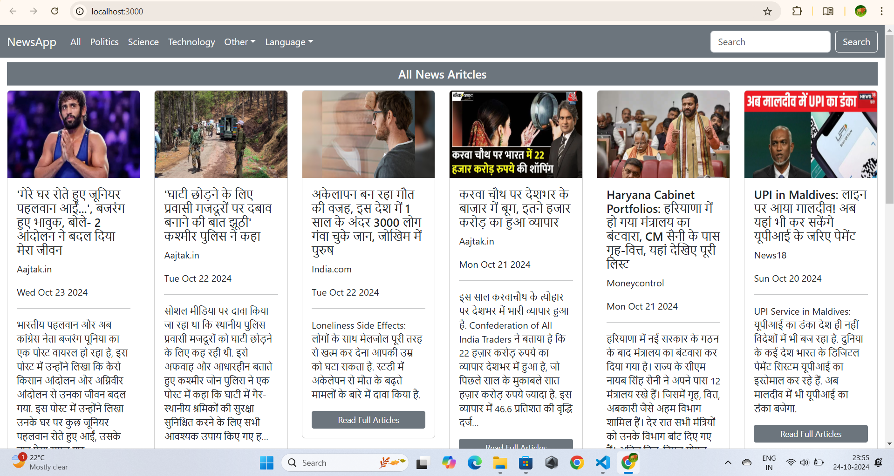
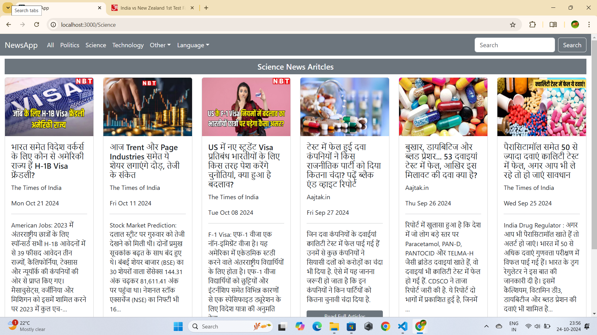
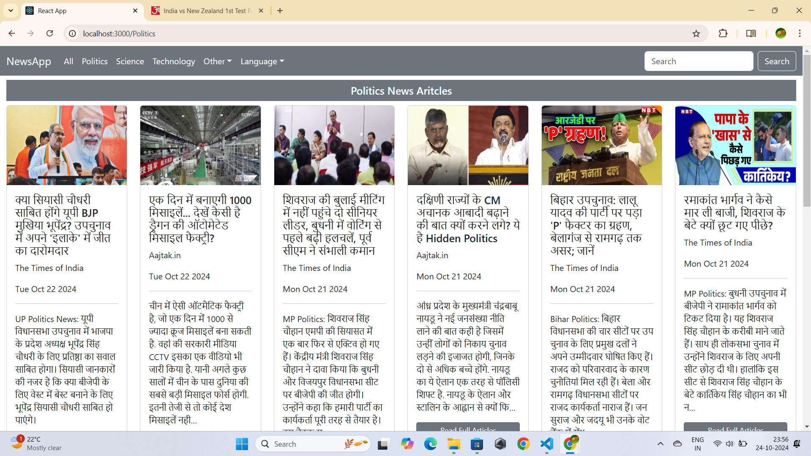

News App
This News App is powered by the GNews public API and delivers the latest news articles globally. It offers a user-friendly interface with categorized news for easier browsing and reading.

Features
Category-based News: Easily browse news articles by categories like entertainment, business, sports, technology, health, science, and more.
Search News: Use the search bar to find articles by entering keywords and view relevant news articles.
Article Details: Each article includes a title, description, publication date, channel, and a link to the full article on the source website.
Responsive Design: Seamlessly adapts to different screen sizes, providing a smooth experience on desktops, tablets, and smartphones.
Technologies Used
React: Core framework for building the UI.
Redux: Handles state management across the application.
Styled-Components: Component-based styling for a clean and maintainable CSS.
React-Bootstrap: Provides pre-built responsive components.
Axios: Used for making HTTP requests to fetch data from the GNews API.
Screenshots
Here are some screenshots of the News App:
## Screenshots

Here are some screenshots of the News App:

Usage
To run the News App locally:

Clone the repository:
git clone https://github.com/rahulYUV/reactNewsRepo.git
Navigate to the project directory:
cd react-news-app
Install dependencies:
npm install
Start the development server:
npm start
Open http://localhost:3000 in your browser.
Contributing
 If you find issues or have suggestions, feel free to open an issue or submit a pull request.

License
This project is licensed under the MIT License.

Acknowledgements
News data powered by GNews API.